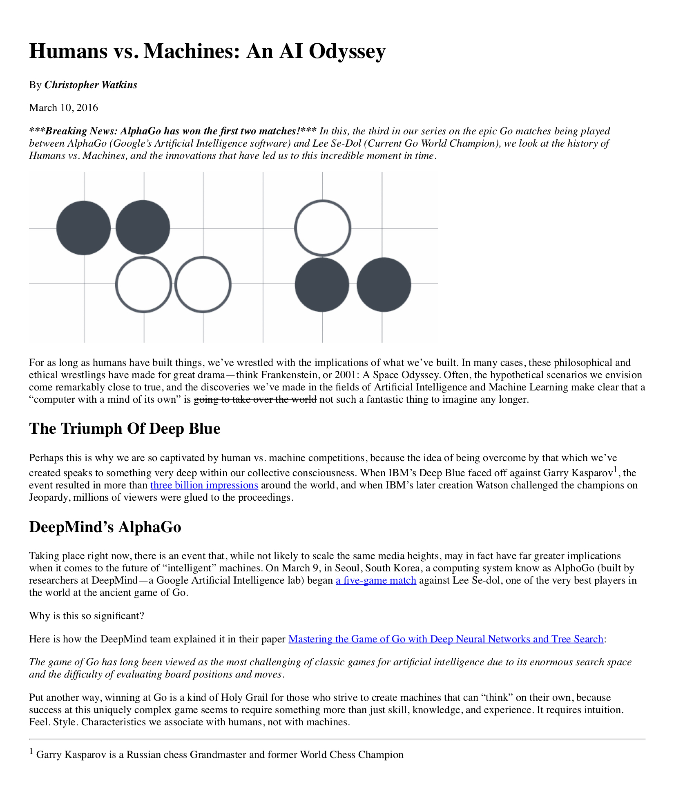

# Mockup to Article

## Overview

Practice HTML syntax by converting a mockup of a blog article into a real website!

## Rubric

### Matching the Mockup

| CRITERIA                | MEETS SPECIFICATIONS                                                     |
| :---------------------: | :------------------------------------------------------------------------|
| Text Formatting         | All text is formatted identically to the mockup. You should not use break ( ) tags for this project. You can create the desired separation with paragraph tags (
text
). |
| Image and Link          | The image’s source is the correct __URL__ and all links in the article are correct. |
